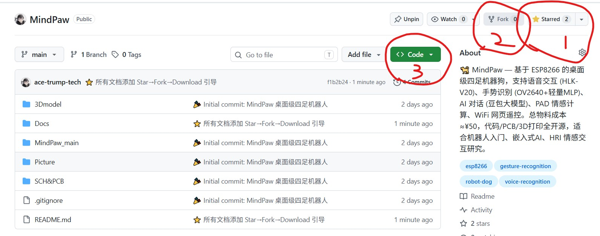

# 01 — 硬件设计导入指南

> ⭐ **使用本教程前，请先支持一下这个开源项目：**
>
> 1. **Star ⭐** — 点击 GitHub 仓库右上角 ⭐ Star，收藏本项目，方便以后找到
> 2. **Fork 🍴** — 点击 Fork，把项目复制到你的 GitHub 账号下，可以自由修改
> 3. **Download 📥** — 点击绿色 **Code** 按钮 → **Download ZIP**，下载到本地开始复刻
>
> 📸 **操作示意图：**
>
> 

---

## 嘉立创 EDA 导入 SCH & PCB

### 1. 打开工程文件

`MindPaw_SCH&PCB.epro2` 是**嘉立创 EDA（立创 EDA）专业版**的工程文件。

**导入步骤：**

1. 访问 [嘉立创 EDA 专业版](https://pro.lceda.cn/) 并登录
2. 点击顶部菜单 **文件 → 打开 → 立创 EDA 专业版**
3. 选择 `SCH&PCB/MindPaw_SCH&PCB.epro2`
4. 等待加载完成，左侧工程面板会显示：
   - `MindPaw_SCH&PCB.sch` — 原理图
   - `MindPaw_SCH&PCB.pcb` — PCB 布局
   - `MindPaw_SCH&PCB.epro2` — 工程文件

### 2. 查看原理图

打开 `.sch` 文件后可看到 MindPaw 的完整电路：

| 模块 | 主要元件 |
|------|---------|
| 主控 | ESP12F (ESP8266) |
| 舵机接口 | 4 路 PWM 输出 |
| 语音模块 | HLK-V20 (UART) |
| 摄像头 | OV2640 (ArduCAM SPI) |
| OLED 显示 | SSD1306 (I2C) |
| 扬声器 | NPN 三极管驱动 |
| 电源 | 电池分压 ADC + 稳压 |

### 3. 编辑与导出 Gerber

**修改 PCB：**
- 在 PCB 编辑器中直接拖拽元件、重新走线
- 修改后按 `Ctrl+S` 保存

**导出 Gerber 文件（用于打样）：**

1. 点击顶部 **文件 → 制造 → Gerber 文件**
2. 在弹出的对话框中保持默认设置
3. 点击 **导出**，系统会生成一个 ZIP 压缩包
4. 这个 ZIP 文件就是发给 PCB 厂家的标准 Gerber 文件

---

## 3D 模型导入嘉立创

### 在嘉立创 EDA 中预览 3D

嘉立创 EDA 专业版支持自动从 PCB 生成 3D 预览：

1. 打开 `.pcb` 文件
2. 点击顶部 **视图 → 3D 预览**（或按 `Shift+3`）
3. 可旋转、缩放查看 PCB 立体视图

### 上传 3D 模型到嘉立创

`3Dmodel/` 目录下有 3 个 STL 文件，是机器狗的**结构外壳**：

| 文件 | 大小 | 说明 |
|------|------|------|
| `body.stl` | 203 KB | 机器狗身体主体 |
| `bottom.stl` | 417 KB | 底盘（安装舵机、电池） |
| `foot.stl` | 211 KB | 脚部（每条腿一个） |

**如果要在嘉立创 3D 打印这些零件：**

1. 访问 [嘉立创 3D 打印](https://3d.jlc.com/)
2. 点击 **上传文件** → 选择一个 `.stl` 文件
3. 设置打印参数：
   - **材料**：推荐 PLA（性价比最高）或 PETG（稍强韧）
   - **层高**：0.2mm（标准）、0.1mm（精细）
   - **填充**：20%（平衡强度与重量）
   - **支撑**：根据需要开启
4. 点击 **自动报价** 查看价格
5. 领取新用户优惠券（见下节指南）
